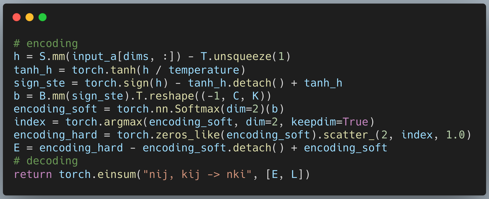

# Stella Nera - Halutmatmul

### Algorithmic CI
[](https://github.com/joennlae/halutmatmul/actions/workflows/python_testing.yaml)
[](https://github.com/joennlae/halutmatmul/actions/workflows/linting.yaml)
[](https://github.com/joennlae/halutmatmul/actions/workflows/python_typing.yaml)

### ML CI
[](https://github.com/joennlae/halutmatmul/actions/workflows/resnet9_validation.yaml)
### Hardware CI

[](https://github.com/joennlae/halutmatmul/actions/workflows/hw_openroad.yaml)
[](https://github.com/joennlae/halutmatmul/actions/workflows/hw_linting.yaml)
[](https://github.com/joennlae/halutmatmul/actions/workflows/hw_dv.yaml)

## Algorithmic

## Maddness algorithm


### Differentiable Maddness



### ResNet-9 LUTs, Thresholds, Dims

* [Download 92%+ Model](https://iis-people.ee.ethz.ch/~janniss/resnet9-best-int8.pth)

### Halutmatmul example

* [example.py](src/python/example.py)

```python
import numpy as np
from halutmatmul.halutmatmul import HalutMatmul

A = np.random.random((10000, 512))
A_train = A[:8000]
A_test = A[8000:]
B = np.random.random((512, 10))
C = np.matmul(A_test, B)

hm = HalutMatmul(C=32, K=16)
hm.learn_offline(A_train, B)
C_halut = hm.matmul_online(A_test)

mse = np.square(C_halut - C).mean()
print(mse)
```

## Hardware OpenROAD flow results from CI

All NanGate45 results are NOT OPTIMIZED! The results are only for reference and to show the flow works.

| All Designs    |  NanGate45      |
| -------------  |  -------------  |
| All Report     | [All](https://github.com/joennlae/halutmatmul-openroad-reports/tree/main/latest/nangate45)  |
| History        | [History](https://github.com/joennlae/halutmatmul-openroad-reports/tree/main/history/nangate45)  |


### Full design (halutmatmul)

Run locally with:
```bash
git submodule update --init --recursive
cd hardware
ACC_TYPE=INT DATA_WIDTH=8 NUM_M=8 NUM_DECODER_UNITS=4 NUM_C=16 make halut-open-synth-and-pnr-halut_matmul
```


### Full Design
| halut_matmul         |  NanGate45      |
| -------------  |  -------------  |
| Area [μm^2]    | 128816 |
| Freq [Mhz]     |  166.7 |
| GE             |  161.423 kGE |
| Std Cell [#]   |  65496 | 
| Voltage [V]    |   1.1             |
| Util [%]       |  50.4 | 
| TNS            |  0 |
| Clock Net      |   |
| Routing        |   |
| GDS            | [GDS Download](https://raw.githubusercontent.com/joennlae/halutmatmul-openroad-reports/main/latest/nangate45/halut_matmul/results/6_final.gds)  |


### Encoder
| halut_encoder_4         |  NanGate45      |
| -------------  |  -------------  |
| Area [μm^2]    | 46782 |
| Freq [Mhz]     |  166.7 |
| GE             |  58.624 kGE |
| Std Cell [#]   |  23130 | 
| Voltage [V]    |   1.1             |
| Util [%]       |  48.7 | 
| TNS            |  0 |
| Clock Net      |   |
| Routing        |   |
| GDS            | [GDS Download](https://raw.githubusercontent.com/joennlae/halutmatmul-openroad-reports/main/latest/nangate45/halut_encoder_4/results/6_final.gds)  |


### Decoder
| halut_decoder         |  NanGate45      |
| -------------  |  -------------  |
| Area [μm^2]    | 24667.5 |
| Freq [Mhz]     |  166.7 |
| GE             |  30.911 kGE |
| Std Cell [#]   |  12256 | 
| Voltage [V]    |   1.1             |
| Util [%]       |  52.1 | 
| TNS            |  0 |
| Clock Net      |   |
| Routing        |   |
| GDS            | [GDS Download](https://raw.githubusercontent.com/joennlae/halutmatmul-openroad-reports/main/latest/nangate45/halut_decoder/results/6_final.gds)  |


## Install

```bash
# install conda environment & activate
# mamba is recommended for faster install
conda env create -f environment_gpu.yml
conda activate halutmatmul

# IIS prefixed env
conda env create -f environment_gpu.yml --prefix /scratch/janniss/conda/halutmatmul_gpu
```

## References

* [arXiv](https://arxiv.org/abs/2106.10860) Maddness paper
* Based on [MADDness/Bolt](https://github.com/dblalock/bolt).

## Hackernews mention (comments only) and discussion

* [HN: Bolt: Faster matrix and vector operations that run on compressed data](https://news.ycombinator.com/item?id=31792206)
