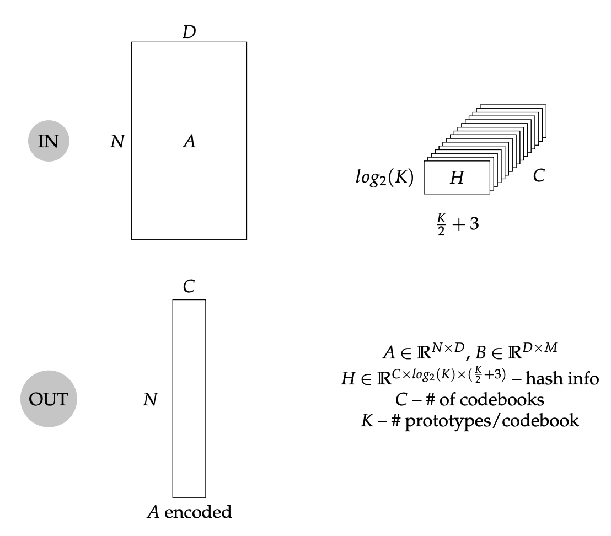
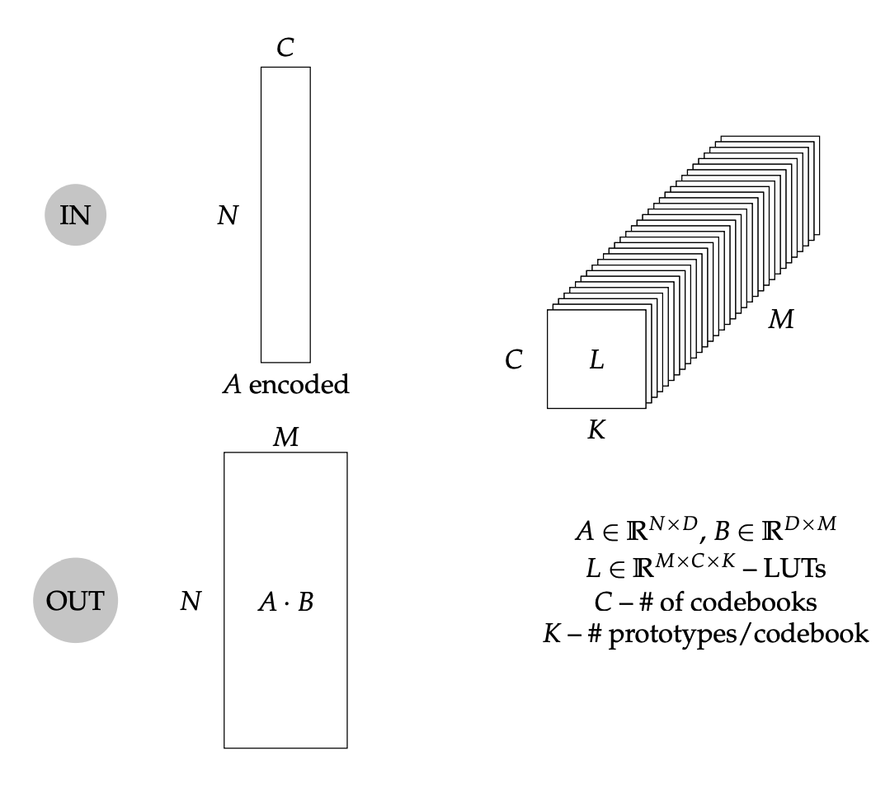

# Hardware TL;DR

## Formalism

Some definitions about the forward path.

### Encode kernel

### Read and accumulate LUTs kernel


### Encoding Unit

* [Encoding called here in code](https://github.com/joennlae/halutmatmul/blob/8461070c6abbe04b8751ed0a9badc7e1c96941e2/src/python/halutmatmul/halutmatmul.py#L353)

#### Four Dim Hash (Maddness)

* [apply_hash_function_opt](https://github.com/joennlae/halutmatmul/blob/a0f4fa48397cdc9de3fda28408527b867358c082/src/python/halutmatmul/functions.py#L36)

```python
@numba.jit(nopython=True, parallel=False)
def apply_hash_function_opt(X: np.ndarray, splits: np.ndarray) -> np.ndarray:
    N, _ = X.shape
    group_ids = np.zeros(N, dtype=np.int64)  # needs to be int64 because of index :-)
    num_splits = splits.shape[0]
    length = splits.shape[1] - 3
    for i in range(num_splits):
        vals = splits[i, 0 : pow(2, i)]
        vals = vals[group_ids]
        dim = int(splits[i, length])
        scaleby = splits[i, length + 1]
        offset = splits[i, length + 2]
        x = X[:, dim] - offset # scaling only needed for quantization
        x = x * scaleby # scaling only needed for quantization
        indicators = x > vals
        group_ids = (group_ids * 2) + indicators
    return group_ids
```

#### Decision Tree

* [apply_hash_function_decision_tree](https://github.com/joennlae/halutmatmul/blob/8461070c6abbe04b8751ed0a9badc7e1c96941e2/src/python/halutmatmul/decision_tree_and_pq.py#L47)

```python
@numba.jit(nopython=True, parallel=False)
def apply_hash_function_decision_tree(
    X: np.ndarray, decision_tree: np.ndarray
) -> np.ndarray:
    N, _ = X.shape
    group_ids = np.zeros(N, dtype=np.int64)  # needs to be int64 because of index :-)

    B = decision_tree.shape[0] // 3
    n_decisions = int(np.log2(B))
    for depth in range(n_decisions):
        index_offet = 2**depth - 1
        split_thresholds = decision_tree[group_ids + B + index_offet]
        dims = decision_tree[group_ids + index_offet].astype(np.int64)
        # x = X[np.arange(N), dims]
        # make it numba compatible
        x = np.zeros(group_ids.shape[0], np.float32)
        for i in range(x.shape[0]):
            x[i] = X[i, dims[i]]
        indicators = x > split_thresholds
        group_ids = (group_ids * 2) + indicators
    group_ids = decision_tree[group_ids + 2 * B].astype(np.int32)
    return group_ids
```

#### Full PQ

* [apply_hash_function_pq](https://github.com/joennlae/halutmatmul/blob/8461070c6abbe04b8751ed0a9badc7e1c96941e2/src/python/halutmatmul/decision_tree_and_pq.py#L81)

```python
def apply_hash_function_pq(X: np.ndarray, prototypes: np.ndarray) -> np.ndarray:
    group_ids = np.argsort(
        np.array([np.linalg.norm(X - x, axis=1) for x in prototypes]).T, axis=1
    )[:, :1].flatten()
    return group_ids
```

## LUT unit

* [LUT lookup called here](https://github.com/joennlae/halutmatmul/blob/8461070c6abbe04b8751ed0a9badc7e1c96941e2/src/python/halutmatmul/halutmatmul.py#L394)

* [read_luts_opt](https://github.com/joennlae/halutmatmul/blob/a0f4fa48397cdc9de3fda28408527b867358c082/src/python/halutmatmul/functions.py#L22)

```python
@numba.jit(parallel=True, nopython=True)
def read_luts_opt(
    A_raveled: np.ndarray,
    A_shape: tuple[int, int],
    B_luts: np.ndarray,
    total_result: np.ndarray,
) -> np.ndarray:
    for i in prange((len(B_luts))):
        read_lut = B_luts[i].ravel()[A_raveled].reshape(A_shape)
        read_lut = read_lut.sum(axis=-1)
        total_result[i] = read_lut
    return total_result
```